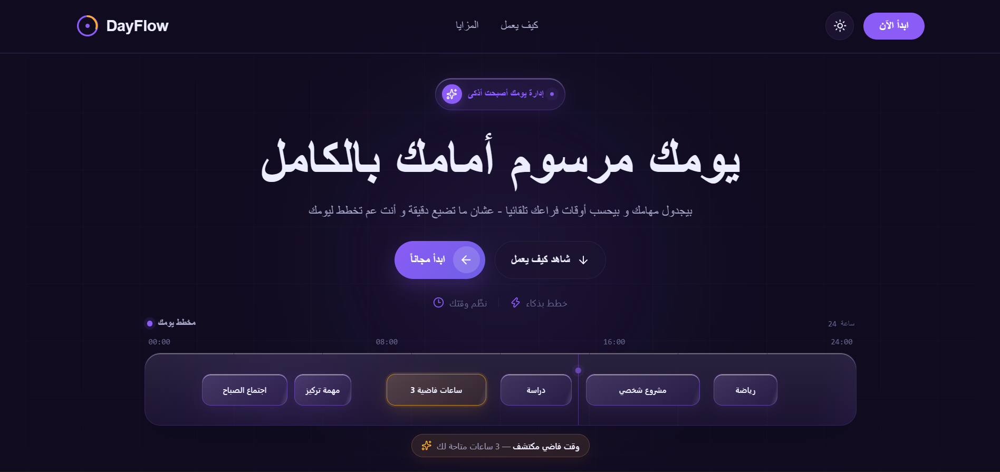
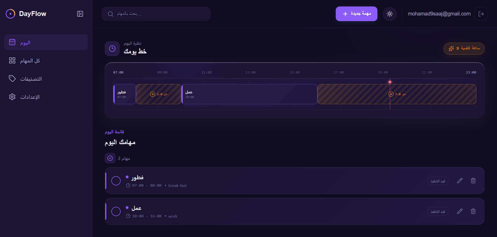
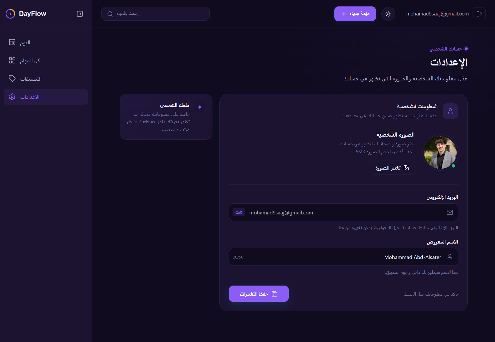

# DayFlow

<p align="center">
  <strong>A smarter way to plan your day.</strong><br />
  DayFlow helps you organize tasks, visualize your schedule, and see the free time between your commitments.
</p>

<p align="center">
  <a href="https://dayflow-mohammad.netlify.app">Live Demo</a>
  ·
  <a href="https://github.com/Mohammad20s6/dayflow">Source Code</a>
  ·
  <a href="https://github.com/Mohammad20s6/dayflow/issues">Report an Issue</a>
</p>



---

## Overview

DayFlow is a full-stack task scheduling application designed to make daily planning clearer and more practical.

Instead of simply displaying a list of tasks, DayFlow focuses on the relationship between **scheduled work and the free time around it**.

Users can create, edit, complete, search, categorize, and delete tasks while DayFlow keeps the schedule synchronized with the backend and calculates the available time between scheduled tasks.

The project was built as a hands-on React application to practice and demonstrate modern front-end development concepts, real backend integration, authentication, server-state management, client/UI state management, responsive design, and a structured feature-based architecture.

## Why DayFlow?

Traditional task managers tell you **what** you need to do.

DayFlow also helps answer:

> **When am I actually free?**

Its core idea is to calculate the available gaps between scheduled tasks and visualize them directly in the daily timeline.

This turns a simple task manager into a lightweight daily scheduling tool focused not only on productivity, but also on understanding how your time is actually being used.

---

## Features

- **Task management** — Create, edit, complete, search, and delete tasks.
- **Free-time detection** — Calculates available gaps between scheduled tasks using the custom `useFreeSlots` hook.
- **Daily timeline** — Visualizes scheduled tasks and available time throughout the day.
- **Custom categories** — Organize tasks with user-defined, color-coded categories.
- **Debounced search** — Reduces unnecessary requests while searching through tasks.
- **Supabase backend** — Persistent application data powered by Supabase and PostgreSQL.
- **Authentication** — User registration, login, session handling, and protected application access.
- **Profile management** — Editable profile information and avatar support.
- **Responsive design** — Adaptive layouts for desktop and mobile devices.
- **Dark / light theme** — Theme switching implemented with CSS custom properties.
- **Modern UI feedback** — Loading, empty, error, confirmation, and toast states throughout the application.
- **Reusable components** — UI and application logic are organized into reusable components and feature modules.

---

## Tech Stack

| Area               | Technology                          |
| ------------------ | ----------------------------------- |
| UI                 | React 19                            |
| Build Tool         | Vite                                |
| Server State       | TanStack Query                      |
| Client / UI State  | Redux Toolkit                       |
| Backend & Database | Supabase / PostgreSQL               |
| Authentication     | Supabase Auth                       |
| Forms              | React Hook Form                     |
| Validation         | Zod                                 |
| Styling            | CSS Modules + CSS Custom Properties |
| Animation          | Motion                              |
| Icons              | Lucide React                        |
| Date Utilities     | date-fns                            |
| Notifications      | Sonner                              |
| Deployment         | Github + Netlify                    |

---

## Architecture

DayFlow separates application responsibilities into clear layers:

```text
                    ┌──────────────────────────┐
                    │        React UI          │
                    │ Pages + Components       │
                    └────────────┬─────────────┘
                                 │
             ┌───────────────────┴───────────────────┐
             │                                       │
             ▼                                       ▼
   ┌─────────────────────┐                ┌─────────────────────┐
   │   TanStack Query    │                │   Redux Toolkit     │
   │                     │                │                     │
   │ Server / async data │                │ UI / client state   │
   │ Cache & mutations   │                │ UI-only state       │
   └──────────┬──────────┘                └─────────────────────┘
              │
              ▼
   ┌─────────────────────┐
   │    Service Layer    │
   │                     │
   │ tasksService        │
   │ categoriesService   │
   │ profileService      │
   │ Supabase client     │
   └──────────┬──────────┘
              │
              ▼
   ┌──────────────────────────────┐
   │           Supabase           │
   │ PostgreSQL + Auth + Storage  │
   └──────────────────────────────┘
```

### Key Architectural Decisions

#### Server State vs. UI State

DayFlow uses **TanStack Query** for asynchronous server data, caching, mutations, and synchronization with Supabase.

**Redux Toolkit** is used for client-side and UI state.

This separation keeps server data management independent from application UI state and prevents Redux from becoming a replacement for server-state management.

#### Service Layer

Database and Supabase operations are organized into dedicated service modules such as:

```text
tasksService.js
categoriesService.js
profileService.js
supabase.js
```

This keeps data-access logic separate from components and makes the application easier to maintain and extend.

#### Custom Hooks

Reusable application logic is extracted into custom hooks, including:

```text
useAuth
useFreeSlots
useDebouncedValue
```

The `useFreeSlots` hook is particularly important to DayFlow's core functionality because it calculates the free-time gaps based on the user's scheduled tasks.

#### Feature-Based Organization

Feature-specific code is grouped under `src/features`:

```text
features/
├── auth/
├── categories/
├── profile/
├── tasks/
└── ui/
```

This approach keeps related logic together and makes the codebase easier to navigate as the application grows.

---

## Project Structure

```text
src/
├── components/
│   ├── dashboard/
│   ├── tasks/
│   └── timeline/
│
├── features/
│   ├── auth/
│   ├── categories/
│   ├── profile/
│   ├── tasks/
│   └── ui/
│
├── hooks/
│   ├── useAuth.js
│   ├── useDebouncedValue.js
│   └── useFreeSlots.js
│
├── i18n/
├── pages/
├── services/
│   ├── categoriesService.js
│   ├── profileService.js
│   ├── supabase.js
│   └── tasksService.js
│
├── styles/
├── utils/
├── App.jsx
├── index.css
├── main.jsx
└── store.js
```

---

## Getting Started

### Prerequisites

Before running DayFlow locally, make sure you have:

- Node.js
- npm
- A Supabase project

### Installation

Clone the repository:

```bash
git clone https://github.com/Mohammad20s6/dayflow.git
cd dayflow
npm install
```

### Environment Variables

Create a `.env` file in the project root:

```env
VITE_SUPABASE_URL=your_supabase_project_url
VITE_SUPABASE_ANON_KEY=your_supabase_anon_key
```

Do not commit your `.env` file or expose private credentials.

### Run the Development Server

```bash
npm run dev
```

### Build for Production

```bash
npm run build
```

### Preview the Production Build

```bash
npm run preview
```

### Run Linting

```bash
npm run lint
```

---

## Live Demo

**[Open DayFlow →](https://dayflow-mohammad.netlify.app)**

The production version of DayFlow is deployed on Netlify.

---

## Screenshots

### Dashboard



The main dashboard provides an overview of the user's tasks and daily schedule.

### Settings



The settings area provides access to application and user preferences.

### Main Interface


The main interface demonstrates DayFlow's scheduling experience and overall visual design.

---

## Development Highlights

DayFlow was built to practice and demonstrate several important front-end engineering concepts:

- Component-driven React architecture
- Custom React hooks
- Server-state management with TanStack Query
- Client/UI state management with Redux Toolkit
- Form management with React Hook Form
- Schema validation with Zod
- Supabase integration
- Authentication and protected application flows
- Separation of data-access logic into service modules
- Responsive design without relying on a utility CSS framework
- CSS Modules and reusable design tokens
- Loading, error, empty, and confirmation states
- Debounced user input
- Scheduling and free-time calculation
- Reusable UI components
- Production deployment with Netlify

---

## Roadmap

The current version focuses on daily task scheduling and free-time visualization.

Possible future improvements include:

- [ ] Full English localization
- [ ] Weekly and monthly scheduling views
- [ ] Calendar integrations
- [ ] Advanced scheduling analytics
- [ ] Additional productivity insights
- [ ] Next.js version

---

## Project Scope

DayFlow is intentionally focused on **daily scheduling** rather than trying to become a complete calendar platform.

The core experience is simple:

**Create tasks → Schedule your day → See your free time → Stay in control.**

---

## Author

**Mohammad Abdelsater Al-Saj**

Front-End Developer focused on building modern React applications.

- GitHub: [@Mohammad20s6](https://github.com/Mohammad20s6)
- LinkedIn: [Mohammad Abdelsater Al-Saj](https://www.linkedin.com/in/mohammad-alsaj/)

---

## License

This project is currently presented as a personal portfolio project.
